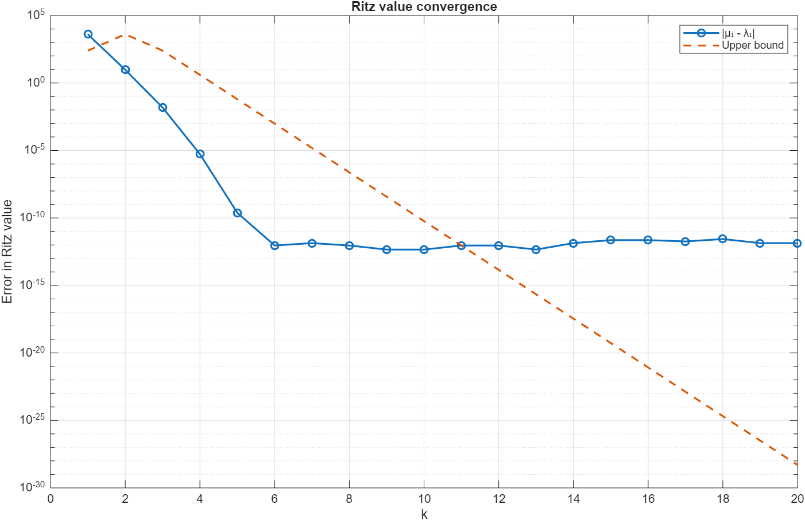
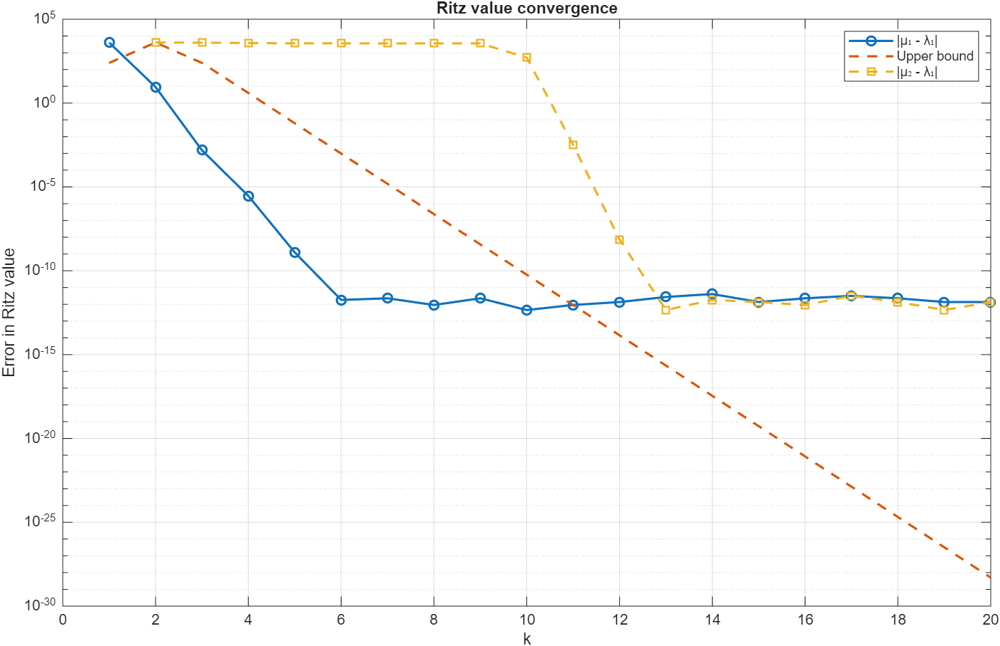

# Numerical Linear Algebra: Gram-Schmidt and Lanczos Toolkit

This repository contains MATLAB implementations and analyses exploring numerical stability in orthonormalization and spectral approximation via Krylov subspace methods.

---

## Project Overview

When dealing with large-scale matrices where direct factorizations are inefficient, iterative Krylov subspace methods offer a robust alternative. This project investigates:
* The numerical stability of Classical vs. Modified Gram-Schmidt and Lanczos orthonormalization procedures.
* Ritz value convergence and theoretical error bounds for extreme eigenvalues using the Lanczos iteration.

---

## Methodology & Findings

### Orthonormalization Stability
Given a symmetric matrix $A$ where $A_{i,j} = \min(i,j)$ for $n = 100$ and starting vector $v = \mathbf{1}$, we construct the $k$-dimensional Krylov subspace $\mathcal{K}_k(A, v) = \text{span}\{v, Av, \dots, A^{k-1}v\}$. Due to severe near-linear dependence ($\kappa(V) \approx 7.07 \times 10^{19}$), standard algorithms perform differently:
* **Classical Gram-Schmidt (CGS)** suffers from loss of orthogonality, yielding an orthogonal error $\Vert{}Q^T Q - I\Vert{} \approx 1.60 \times 10^{-3}$.
* **Modified Gram-Schmidt (MGS)** maintains stability with an error of $3.19 \times 10^{-9}$.
* **The Lanczos Algorithm** achieves similar high-precision orthogonality ($\Vert{}Q^T Q - I\Vert{} \approx 1.00 \times 10^{-9}$) while exploiting symmetry for enhanced efficiency.

### Eigenvalue Approximation & Ritz Values
Using the Lanczos tridiagonal matrix $T_k$, we approximate the extreme eigenvalues of $A$ (where $\lambda_1 = 4093.56$). The error of the largest Ritz value $\mu_1$ is bounded by Theorem 1:
$$\lambda_1 \ge \mu_1 \ge \lambda_1 - (\lambda_1 - \lambda_n)\left(\frac{2\rho^{k-2}}{1+\rho^{2(k-2)}}\right)^2 \tan^2(\angle(v, w_1))$$

### Visualizations

#### Highest Ritz Value Convergence vs. Upper Bound


#### Second Highest Ritz Value Convergence


### Key Observations
* **Bound Agreement**: From iterations $k=2$ to $k=10$, empirical errors closely follow the theoretical upper bound until reaching machine precision thresholds ($\sim 10^{-12}$).
* **Ghost Eigenvalues**: In extended iterations, loss of orthogonality in finite-precision arithmetic causes multiple Ritz values to repeatedly converge to the same dominant eigenvalues.

---

## Repository Structure

```text
├── problem1_orthonormalization/   # Classical GS vs. Modified GS vs. Lanczos stability analysis
├── problem2_eigenvalues/          # Lanczos iteration, Ritz values, and theoretical error bounds
└── assets/                        # Convergence plots and visualizations
